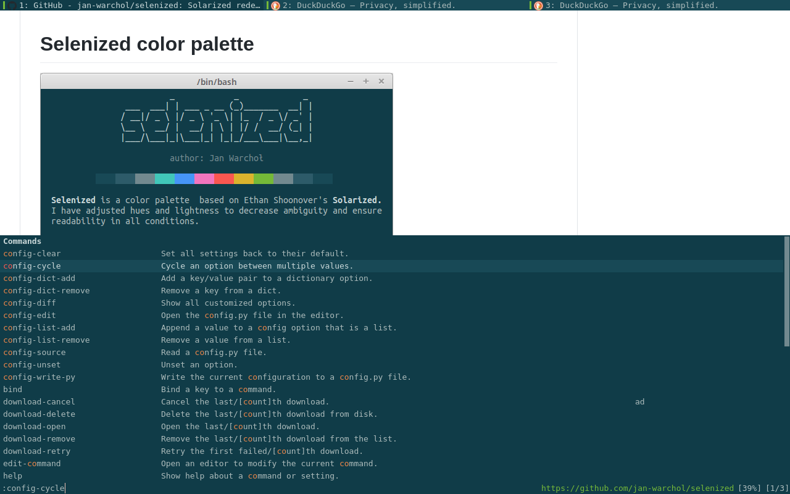

# Selenized for Qutebrowser


## Install
In your qutebrowser configuration directory, run
```
git clone https://gitlab.com/lovetocode999/selenized-qutebrowser.git
```
Then, add the following snippet to your config.py:
```
sys.path.append(os.path.join(sys.path[0], "selenized-qutebrowser"))
config.source("selenized-qutebrowser/qutebrowser.py")
```
